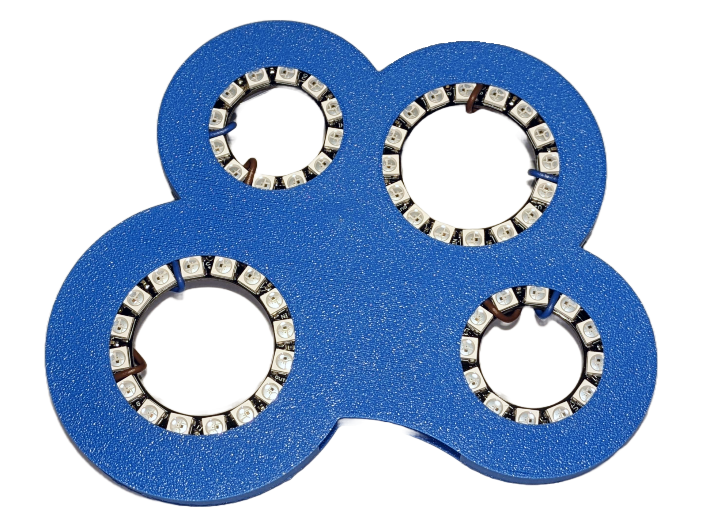
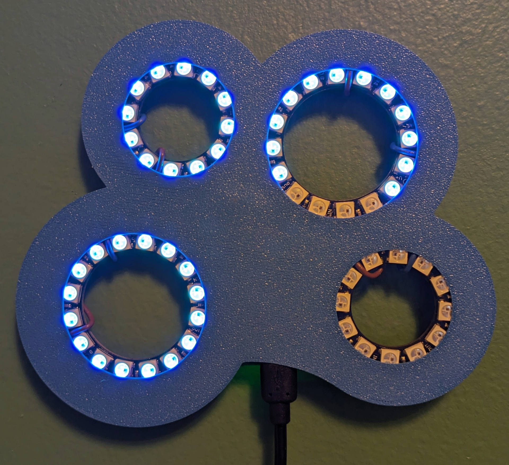

# Countup: Time-based Light Art

[💡 Description](#description) &nbsp; [🪛 Hardware Build](#hardware-build) &nbsp; [💻 Usage](#usage) &nbsp; [📑 Resources](#resources)

---

|  |  |
|-|--------------------------|

## Description

Time-based NeoPixel wall art with wheels that fill over different spans.

In the default configuration, the neopixel rings fill as follows (listed left to right)

| Wheel | Pixel Count | Fill Time  |
|-------|-------------|------------|
| Large | 16          | 1 year     |
| Small | 12          | 1 hour     |
| Large | 16          | 10 minutes |
| Small | 12          | 1 week     |

### Next Up

- [ ] Install frosted acrylic in each wheel to diffuse the NeoPixels
- [ ] Add a button to allow starting one wheel as a filling hourglass for a preset time
- [ ] Create desktop widget to reload Trinket with a selected brightness and set of time spans

## Hardware Build

### Materials

* Adafruit Trinket - 3v logic
* NeoPixel Rings or Strips 
  * For the configuration shown - 2 x 12 pixel rings, 2 x 16 pixel rings
  * Update the starting LED definitions following the [usage](#usage) instructions to use other ring layouts, strips for filling light bars, etc.
* Real Time Clock -> DS3231 Breakout Board + CR1220 coin battery
* 3D Printed housing: see `.stl` files in the `/part-files` directory

### Assembly

1) Wire the RTC to the trinket following the guide on the product page: [https://www.adafruit.com/product/3013](https://www.adafruit.com/product/3013)

2) Use `USB+` and `GND` on the trinket to provide power to the neopixels if you are using fewer than 50 total pixels. Otherwise, see [this guide](https://learn.adafruit.com/adafruit-neopixel-uberguide/powering-neopixels) to provide an external power source.

3) Chain all the NeoPixels, using `Pin 1` on the Trinket for the initial `DIn`

4) Package it into the 3D printed housing with each wheel mounted in a ring and the Trinket between the bottom guide rails.  The USB port should face out of the enclosure.

## Usage

### Step 1 - Configure the Trinket for programming

Configure the Arduino IDE to load the source code onto the Trinket following the instructions in [this guide](https://learn.adafruit.com/introducing-trinket/introduction)

### Step 2 - Test the hardware connections

Load `/trinket-src/neopixel-test.ino` onto the Trinket and ensure that all pixels cycle through being set to green.

### Step 3 - Load the code

Load `/trinket-src/countup.ino` onto the Trinket.  Use the configuration at the top of the file to change how each light wheel is filled.

### Configuration

Update the starting LED definitions in `countup.ino` to use other LED configurations.

## Resources

* [Adafruit Trinket Programming Setup](https://learn.adafruit.com/introducing-trinket/introduction)
* [Adafruit NeoPixel Clock Project](https://learn.adafruit.com/neopixel-60-ring-clock/overview)
